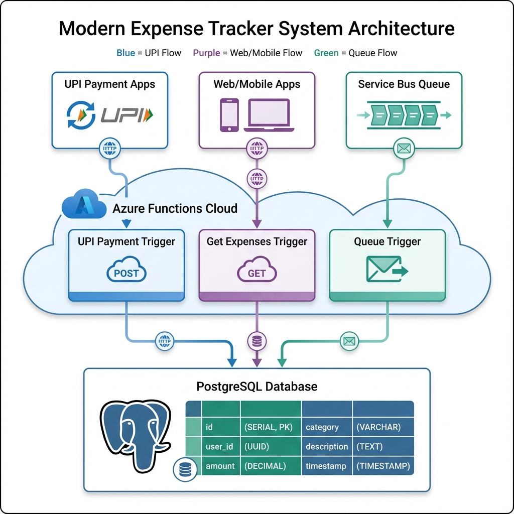

# 💰 Expense Tracker - Azure Functions v4 (.NET 8)

A serverless expense tracking system built with **Azure Functions v4** and **C# .NET 8** that automatically processes UPI payment notifications and stores them in **PostgreSQL**.

## 🚀 Features

- ✅ **HTTP Trigger** - Process UPI payments via REST API
- ✅ **Service Bus Queue Trigger** - Asynchronous payment processing from message queue
- ✅ **PostgreSQL Database** - Persistent storage with Entity Framework Core
- ✅ **Duplicate Detection** - Prevents duplicate transaction entries
- ✅ **Query API** - Retrieve expenses with filtering and pagination
- ✅ **Azure Functions v4** - Latest isolated worker model
- ✅ **.NET 8** - Modern C# features and performance

## 📋 Prerequisites

- .NET 8 SDK
- PostgreSQL 12+ (local or cloud)
- Azure Functions Core Tools v4
- Visual Studio 2022 or VS Code with Azure Functions extension (optional)
- Azure Service Bus (for queue trigger - optional)

## 🛠️ Project Flow




## 🛠️ Project Structure

```
ExpenseTracker.Functions/
├── Data/
│   └── ExpenseDbContext.cs          # EF Core DbContext
├── DTOs/
│   ├── UpiPaymentRequest.cs         # Request DTO
│   └── ExpenseResponse.cs           # Response DTO
├── Functions/
│   ├── UpiPaymentTrigger.cs         # HTTP trigger for UPI payments
│   ├── UpiPaymentQueueTrigger.cs    # Service Bus queue trigger
│   └── GetExpensesTrigger.cs        # Query expenses API
├── Models/
│   └── Expense.cs                   # Database entity
├── Program.cs                        # Application startup
├── host.json                         # Function host configuration
└── local.settings.json              # Local configuration (not in git)
```

## ⚙️ Setup Instructions

### 1. Clone and Restore Packages

```bash
cd "d:\Project\Invenstement Tracker"
dotnet restore
```

### 2. Configure PostgreSQL Connection

Copy the sample settings file:
```bash
copy local.settings.sample.json local.settings.json
```

Update `local.settings.json` with your PostgreSQL connection string:
```json
{
  "Values": {
    "PostgreSqlConnection": "Host=localhost;Database=ExpenseTrackerDb;Username=postgres;Password=your_password"
  }
}
```

### 3. Create Database and Run Migrations

Install EF Core tools (if not already installed):
```bash
dotnet tool install --global dotnet-ef
```

Create initial migration:
```bash
dotnet ef migrations add InitialCreate
```

Update database:
```bash
dotnet ef database update
```

### 4. Run the Function App Locally

```bash
func start
# or
dotnet run
```

The function app will start on `http://localhost:7071`

## 📡 API Endpoints

### 1. Add UPI Payment (HTTP Trigger)

**Endpoint:** `POST http://localhost:7071/api/upi/payment`

**Request Body:**
```json
{
  "transactionId": "UPI123456789",
  "upiId": "user@paytm",
  "merchantName": "Amazon",
  "amount": 1299.99,
  "currency": "INR",
  "description": "Electronics purchase",
  "category": "Shopping",
  "transactionDate": "2025-11-23T01:30:00Z",
  "status": "Success"
}
```

**Response (201 Created):**
```json
{
  "id": "3fa85f64-5717-4562-b3fc-2c963f66afa6",
  "transactionId": "UPI123456789",
  "paymentMethod": "UPI",
  "upiId": "user@paytm",
  "merchantName": "Amazon",
  "amount": 1299.99,
  "currency": "INR",
  "description": "Electronics purchase",
  "category": "Shopping",
  "transactionDate": "2025-11-23T01:30:00Z",
  "createdAt": "2025-11-23T01:50:00Z",
  "status": "Success"
}
```

### 2. Get All Expenses

**Endpoint:** `GET http://localhost:7071/api/expenses`

**Query Parameters:**
- `category` - Filter by category (optional)
- `startDate` - Filter by start date (optional)
- `endDate` - Filter by end date (optional)
- `limit` - Limit results (default: 100)

**Example:**
```
GET http://localhost:7071/api/expenses?category=Shopping&limit=10
```

**Response:**
```json
{
  "count": 10,
  "expenses": [
    {
      "id": "3fa85f64-5717-4562-b3fc-2c963f66afa6",
      "transactionId": "UPI123456789",
      "merchantName": "Amazon",
      "amount": 1299.99,
      ...
    }
  ]
}
```

### 3. Get Expense by ID

**Endpoint:** `GET http://localhost:7071/api/expenses/{id}`

**Example:**
```
GET http://localhost:7071/api/expenses/3fa85f64-5717-4562-b3fc-2c963f66afa6
```

## 🔄 Service Bus Queue Trigger (Optional)

To use the Service Bus queue trigger:

1. Create an Azure Service Bus namespace and queue named `upi-payments`
2. Add the connection string to `local.settings.json`:
```json
{
  "Values": {
    "ServiceBusConnection": "Endpoint=sb://your-namespace.servicebus.windows.net/;..."
  }
}
```

3. Send messages to the queue with the same JSON format as the HTTP trigger

## 🗄️ Database Schema

### Expenses Table

| Column | Type | Description |
|--------|------|-------------|
| Id | UUID | Primary key |
| TransactionId | VARCHAR(200) | Unique transaction identifier |
| PaymentMethod | VARCHAR(100) | Payment method (UPI) |
| UpiId | VARCHAR(200) | UPI ID of sender |
| MerchantName | VARCHAR(200) | Merchant/receiver name |
| Amount | DECIMAL(18,2) | Transaction amount |
| Currency | VARCHAR(50) | Currency code (INR) |
| Description | VARCHAR(500) | Transaction description |
| Category | VARCHAR(100) | Expense category |
| TransactionDate | TIMESTAMP | When transaction occurred |
| CreatedAt | TIMESTAMP | When record was created |
| UpdatedAt | TIMESTAMP | When record was updated |
| Status | VARCHAR(50) | Transaction status |
| RawPayload | TEXT | Original JSON payload |

**Indexes:**
- Unique index on `TransactionId`
- Index on `TransactionDate`
- Index on `Category`

## 🚀 Deployment to Azure

### 1. Create Azure Resources

```bash
# Create resource group
az group create --name ExpenseTrackerRG --location eastus

# Create storage account
az storage account create --name expensetrackerstorage --resource-group ExpenseTrackerRG --location eastus

# Create function app
az functionapp create --resource-group ExpenseTrackerRG --consumption-plan-location eastus \
  --runtime dotnet-isolated --runtime-version 8 --functions-version 4 \
  --name ExpenseTrackerFunctions --storage-account expensetrackerstorage
```

### 2. Configure Application Settings

```bash
az functionapp config appsettings set --name ExpenseTrackerFunctions \
  --resource-group ExpenseTrackerRG \
  --settings "PostgreSqlConnection=Host=your-server;Database=ExpenseTrackerDb;Username=user;Password=pass"
```

### 3. Deploy Function App

```bash
func azure functionapp publish ExpenseTrackerFunctions
```

## 🧪 Testing

### Using cURL

```bash
# Add expense
curl -X POST http://localhost:7071/api/upi/payment \
  -H "Content-Type: application/json" \
  -d '{
    "transactionId": "UPI123456789",
    "upiId": "user@paytm",
    "merchantName": "Amazon",
    "amount": 1299.99,
    "category": "Shopping",
    "transactionDate": "2025-11-23T01:30:00Z"
  }'

# Get expenses
curl http://localhost:7071/api/expenses
```

### Using PowerShell

```powershell
# Add expense
$body = @{
    transactionId = "UPI123456789"
    upiId = "user@paytm"
    merchantName = "Amazon"
    amount = 1299.99
    category = "Shopping"
    transactionDate = "2025-11-23T01:30:00Z"
} | ConvertTo-Json

Invoke-RestMethod -Uri "http://localhost:7071/api/upi/payment" -Method Post -Body $body -ContentType "application/json"

# Get expenses
Invoke-RestMethod -Uri "http://localhost:7071/api/expenses"
```

## 📊 Categories

Suggested expense categories:
- Shopping
- Food & Dining
- Transportation
- Entertainment
- Bills & Utilities
- Healthcare
- Education
- Travel
- Others

## 🔒 Security Considerations

- Use **Azure Key Vault** for storing connection strings in production
- Enable **Function-level authorization** (already configured)
- Use **Managed Identity** for Azure resource access
- Implement **rate limiting** for public endpoints
- Add **input validation** and sanitization
- Enable **Application Insights** for monitoring

## 📝 License

MIT License - Feel free to use this project for your own expense tracking needs!

## 🤝 Contributing

Contributions are welcome! Please feel free to submit a Pull Request.

---

**Built with ❤️ using Azure Functions v4 and .NET 8**
